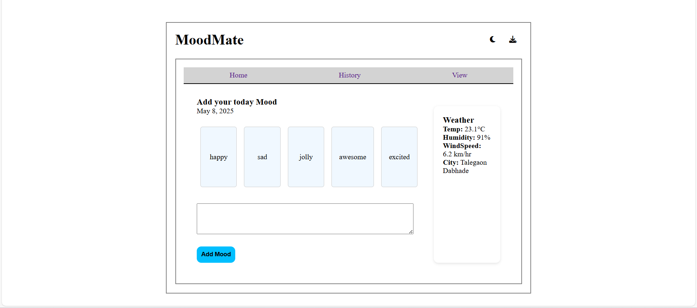
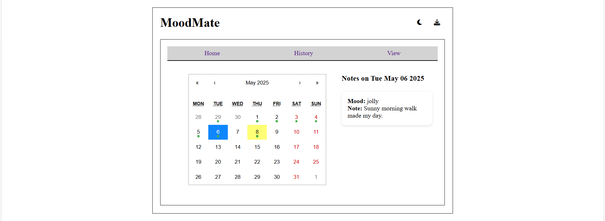
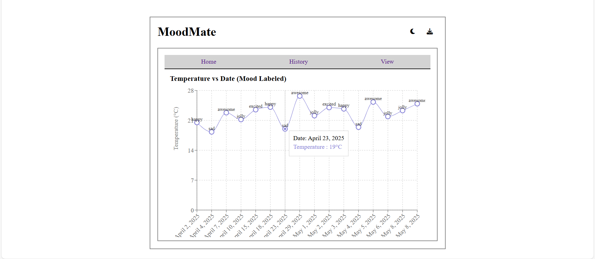

# MERN Stack Calendar App

A full-stack calendar application built using the MERN stack (MongoDB, Express.js, React.js, Node.js) that allows users to manage their events efficiently.

## Installation & Setup  
To get started, clone the repo and install dependencies:  
```bash
git clone https://github.com/your-repo/SIH.git
cd SIH
```
Install dependencies and start servers
```bash
cd frontend
npm install
npm run dev

cd ../backend
npm install
node index.js
```

## Screenshots

### Homepage View



*Description: The homepage features an overview of upcoming events, quick access to the calendar, and user-friendly navigation.*

### Calendar Page



*Description: The calendar page displays events in a monthly view, with options to add, edit, or delete events.*

### Detailed Graph Page



*Description: The calendar page displays events in a monthly view, with options to add, edit, or delete events.*

## 🛠️ Technologies Used

- **Frontend**:
  - ReactJS
  - react-big-calendar
  - Bootstrap
  - Tostify

- **Backend**:
  - Node.js
  - Express.js
  - MongoDB
  - Mongoose

---
